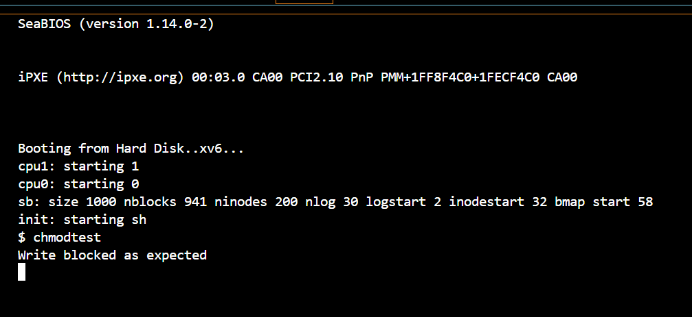
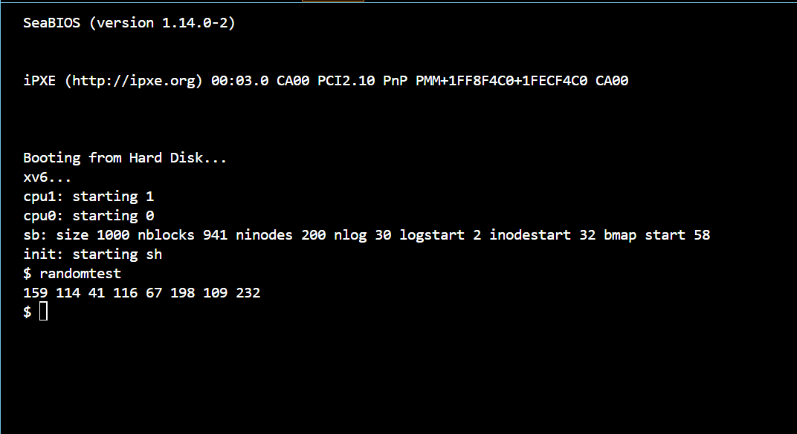

# 📝 Laporan Tugas Akhir

**Mata Kuliah**: Sistem Operasi
**Semester**: Genap / Tahun Ajaran 2024–2025
**Nama**: `Leila Aristawati`
**NIM**: `240202901`
**Modul yang Dikerjakan**:
`Modul 4 - Subsistem Kernel Alternatif (xv6-public)`

---

## 📌 Deskripsi Singkat Tugas

Tuliskan deskripsi singkat dari modul yang Anda kerjakan. Misalnya:

* **Modul 4 - Subsistem Kernel Alternatif**:
 Modul ini mencakup pengembangan dua fitur subsistem kernel pada xv6:
1. System call chmod(path, mode) untuk mengatur mode file (read-only atau read-write) secara sederhana.
2. Pseudo-device /dev/random yang menghasilkan byte acak ketika dibaca, menyerupai fungsionalitas /dev/random di sistem UNIX/Linux.
---

## 🛠️ Rincian Implementasi

Menambahkan field mode pada struct inode di fs.h (bersifat volatile, hanya di memori).

Menambahkan syscall chmod() di:

sysfile.c (sys_chmod)

syscall.h, syscall.c, user.h, usys.S

Modifikasi filewrite() di file.c untuk mencegah penulisan ke file dengan mode read-only.

Program uji: chmodtest.c

Device /dev/random

Menambahkan file random.c sebagai driver sederhana penghasil angka acak.

Registrasi device di file.c melalui devsw[] dengan major number 3.


## ✅ Uji Fungsionalitas

Program uji yang digunakan:

1. chmodtest: menguji sistem file agar menolak penulisan ke file read-only

2. randomtest: membaca 8 byte acak dari /dev/random

---

## 📷 Hasil Uji

### 📸 Screenshot:

### 📸 Screenshot:


### 📍 Contoh Output `chmodtest`:

```
Write blocked as expected
```

### 📍 Contoh Output `randomtest`:

```
159 114 41 116 67 198 109 232
```

Jika ada screenshot:

```

```

---

## ⚠️ Kendala yang Dihadapi

Kendala yang Dihadapi

1. Error Undefined Reference
Terjadi saat kompilasi karena beberapa fungsi seperti setupkvm, walkpgdir, dan mappages tidak dikenali. Penyebabnya karena belum dideklarasikan di defs.h atau file sumber tidak disertakan dalam build.
2. Linker Error karena Fungsi Terpisah
Fungsi-fungsi baru seperti cowuvm dan refcount awalnya dibuat di file terpisah tanpa update di Makefile, sehingga tidak terlink dengan benar.
3. Kesalahan Perhitungan Alamat Fisik
Pada pa2refindex, terjadi panic jika alamat fisik tidak valid atau di luar batas PHYSTOP.
4. Modifikasi PTE Tidak Konsisten
Saat men-set flag PTE_COW, perlu memastikan bahwa entri tidak rusak dan tetap bisa diakses oleh proses yang membagikan halaman tersebut.
5. Build Tidak Bersih
Perubahan kode tidak selalu tercermin karena tidak menjalankan make clean sebelum make, sehingga menggunakan object file lama.

---

## 📚 Referensi

Tuliskan sumber referensi yang Anda gunakan, misalnya:

* Buku xv6 MIT: [https://pdos.csail.mit.edu/6.828/2018/xv6/book-rev11.pdf](https://pdos.csail.mit.edu/6.828/2018/xv6/book-rev11.pdf)
* Repositori xv6-public: [https://github.com/mit-pdos/xv6-public](https://github.com/mit-pdos/xv6-public)
* Stack Overflow, GitHub Issues, diskusi praktikum

---

